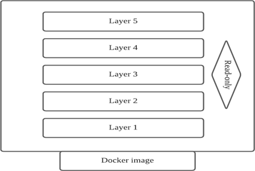

GROUP MEMBERS | MATRIC NO
------------ | -------------
Abdulrahman Alaidaros | 1826053
HASSAN | 1827297
Zakarya Ahmed Babatat  | 1817749
Roki Md Rasel Rana | 1820927

## Table of Contents
* Abstract 	                                                          
* Introduction	 	                                                      
* What is docker?	 	                                                  
* Why use containers in docker?	 	                                    
* What is the difference between docker and virtual machines?	 	     
* Describe some of the docker tools provided	 	                        
* What are docker images?	 	                                          
* How do you manage data and volume in docker?	 	                      
* How does container network communication work?	                      
* How does networking in Kubernetes work?	 	                          
* How do you manage data and volume in Kubernetes?	                    
* How is Kubernetes used for scalability?	 	                         
* Conclusion	 	                                                        
* References	 	                                                        

## Abstract
In this paper, we will analyze Docker and its various futures. We'll look into what Docker is, how it's used, and how it differs from other comparable concepts and use cases. Our experts will thoroughly investigate each subject, using a variety of online resources. We'll cover Docker in this paper.

## Introduction
A computer user's interaction with the machine's hardware is provided by the operating system. An operating   system is responsible for everything from file management and memory management to process management and handling input and output. As the link between the user's commands and the computer's hardware, this software directs the execution of all other kinds of programs.
There are two fascinating operating system issues covered in this term paper: docker and Kubernetes. Docker is a platform for running programs and making the process of developing and distributing them more efficient. Kubernetes, on the other hand, uses container technology. Any containerization technique can theoretically work with Kubernetes. Rot and Docker are two of the most popular third-party integrations for Kubernetes. As a result, more work has been put into refining the integration between Docker and Kubernetes than has been put into any other containerization technique. Both of them shared certain similarities with us. Open-source communities are dear to their hearts. Both are significant open-source initiatives.

## What is docker?
Docker is a free and open-source platform for running applications and streamlining the development and distribution of software applications. Using docker, applications can be packaged in a standard form called a container, which includes all of the necessary components. These containers run on top of the operating system's kernel in an isolated manner. Docker is a virtual machine in a container form. However, unlike a virtual machine, Docker merely requires that apps be supplied with things not already running on the host computer, rather than establishing a virtual operating system from scratch. The application's speed and size are both improved as a result of this. The additional abstraction layer may have an impact on performance. When you consider that containers have been available for over a decade, docker stands out as one of the best breakthroughs since it has new capabilities that other technologies lacked. The ability to construct and govern containers is the first benefit of this system. In addition, docker containers can be created by the developer and used to package apps. Virtualized programs can be used from any location without requiring any additional setups or modifications. On top of that, docker is capable of displaying more virtual scenarios than other breakthroughs, all on the same piece of software. To summarize, third-party instruments can simply cooperate with Docker to facilitate the deployment and management of Docker containers.

## Why use containers in docker?
In order to simplify the process of building, deploying, and running software in containers, the Docker project was created. There are a number of ways in which containers may be used to package up a program and ship all of its components together. There's no need to install anything on a server to run code in a Docker container because the entire filesystem is contained within the container. Containers are segregated from their host system and also from other containers, so that they can be run in a secure environment as a result, the software will always function the same manner, no matter what the circumstances. By eliminating the requirement for a whole OS, TCP, and file system stack for each container in Docker's container-based architecture, the technology is receiving a lot of attention. Docker makes use of containers as well because of the numerous advantages they give, including the following:

1. Speed: With regard to performance, Containers are frequently extolled for their lightning quickness. When discussing the advantages of utilizing docker, it would be impossible not to mention the speed of docker. Because containers are so compact, they may be constructed in a short period of time. As containers are compact, the development, testing, and deployment process may be completed more quickly. Once a container has been constructed, it can be deployed to a test environment and ultimately to a production environment.

2. Portability: Those applications that are built inside docker containers are extremely portable. These portable applications can easily be moved as a single element and the performance remains the same.

3. Scalability: Docker has the feature that it may be deployed in various physical servers, data servers, and cloud platforms. It can also be run on every Linux machine. Containers can simply be transported from a cloud environment to a local host and from there back to cloud again at a quick speed. Adjustments can easily be done; the scale can simply be modified by the user according to the necessity.

4. Rapid Delivery: Docker Containers have a common format, so programmers don't have to worry about each other's work. The administrator is in charge of deploying and maintaining the server with containers, while the programmer is in charge of the apps running inside the docker container. Containers can work in any environment since they have all of the needed dependencies and have been thoroughly vetted. When code is moved between development, test, and production systems, Docker provides a dependable, consistent, and better environment, allowing for predictable results.

5. Density: Docker uses the resources that are available more efficiently because it does not use a hypervisor. This is the reason that more containers can be run on a single host as compared to virtual machines. The performance of a Docker Container is higher because of higher density and no overhead wastage of resources.

## What is the difference between docker and virtual machines?
On the host system, the hypervisor is installed, allowing the guest OS to be installed on top of the hypervisor (the host OS sits on top of the hardware). Shipment of the guest OS is possible. It is compatible with the same operating system on other PCs when shipped.
But the concept of hypervisor is not feasible because there are cases where every application might need their own guest OS. And we cannot run multiple operating systems on the same hardware, since that will waste a lot of resources such as CPU, RAM and others. And another problem with hypervisors is licenses. Every OS has its own licenses, and that would cost a lot of money. This is how Docker is different. Docker sits on the OS, without a hypervisor. And Docker can have multiple containers to run different full-fledged applications, along with their respective dependencies. And the containers on dockers are customizable. One can create their own containers.

# Describe some of the docker tools provided.
### Docker tools: 
tag The Docker ecosystem is growing faster than ever, and we can see a lot of Docker tools available for developers. Some of the most useful docker tools are listed below:

Clair (Security): This one is free to use. You may monitor the security of your containers through static analysis of vulnerabilities in appc and docker containers with this open-source project. Clair is an API-driven analysis engine that looks for known security problems in containers one layer at a time. The indexed contents of container pictures are correlated with important and sensitive data imported from a well-known set of sources to provide lists of vulnerabilities that threaten a container. Clair is an effective method for ensuring the safety of a container.

Docker Notary (Security): Another security-based Docker project tool. It is mainly security for data collection. Digitally sign published collections with this tool and allow the users to confirm the integrity and source of content.

CodeShip (CI/CD): It is a customizable CI platform and provides native support for Docker by working with Docker workflows. It also automates testing and also supports many cloud platforms and orchestration tools.

CircleCI (CI/CD): It ensures delivering value to clients. CircleCI boosts Developers productivity by making the CI process quicker, simpler, and easier. It integrates quickly and allows you to build and deploy immediately after signup. It debugs manually through SSH (Secure shell) and dynamically scales the number of containers at the same time when beginning a project.

Prometheus (Monitoring): Prometheus is quite popular and free to use as well. It helps to do system monitoring and altering. It mainly works to do metric generation and collection. Prometheus excels at recording numeric time series and complements both machine-centric monitoring as well. It is built by SoundCloud.

It is a multidimensional data model and helps to slice and dice at will as well as dimensions like instance, service, endpoint, and methods.

Sysdig Monitor (Monitoring): Sysdig Monitor (formally called Sysdig Cloud) is Sysdig's commercial solution for the generation and analysis of system-level information and real-time data. “Sysdig Monitor is the first commercially available cloud monitoring platform that is fully compatible with Prometheus. Give developers their preferred
monitoring approach without the management headache” according to their official website (https://sysdig.com/products/monitor)

## What are docker images?
### Docker images: 
A Docker image is the set of processes described in the corresponding Docker file. It's a file that has many different layers. Layers of processes are created automatically. Layers are interconnected and reliant on one another. Essentially, an image is a set of instructions for creating a fully-functional application that can run on the target system's kernel. For example, by abstracting instructions, an isolated environment can be built that can nevertheless function. A docker image can be generated by modifying an existing image to fit the needs of the container in question. Docker containers and images are two distinct things. A docker file can also be written from scratch.
Docker image is intermediate between other Docker functions. A Docker image consists of the elements needed to run an application as a container -- for example code, config files, environment variables, libraries and run time. The hierarchy of layers is key to efficient lifecycle management of Docker images, but developers should organize layers that change the most often as high up the stack as possible. It is to handle any kind of unexpected situation.

## How do you manage data and volume in docker?
### DATA:
If the container no longer applies, the data does not exist, and if another method requires it, it may be hard to get the data out of the container.
The writing layer of a container is closely linked to the host computer where the container is operating. Users can't transfer the data anywhere else quickly.
Writing into the executable layer of a container allows the file system to be handled by a storage driver. The storage driver, using the Linux kernel, supports a union directory. In contrast to using data volumes that write directly to the server directory, this extra complexity reduces performance.
### VOLUME:
Users may directly build a volume using the create docker volume method, or Docker can create a volume during the development of a container or network.
	When users create a volume, it is stored on the Docker host inside a directory. This directory is what's installed in the container when users mount a volume into a container.
Volumes are placed in a portion of the Docker (docker/volumes/ on Linux) controlled server directory. This section of the kernel should not be changed by non-Docker processes. Volumes in Docker are the perfect way for data to survive.

## How does container network communication work?
In Docker's scenario, the connection is designated docker 0.0. All device containers communicate with one another by routing packets to docker0, which queues the packets via the subnet right away. Sdn controller IPv6 addresses let containers communicate with different domains. Docker containers serve as the framework for a programme, making it easier to work with and resolving issues. Container networking is a cloud computing method that splits programs into independent boxes. Containers are similar to virtual servers, with a few key differences. Containers with low latency can demand large application applications. They achieve this by replacing a kernel (often based on Linux) with a sheared operating system, resulting in a more powerful operating system. Also, containers are simpler than Virtual machines, too. They also have lightweight Linux operating systems such as Fedora CoreOS, which is part of the Red Hat community and the predecessor to CoreOS Server Linux. Network administrators may use container software applications such as Docker to develop large frameworks that can run in the background for application components.

## How does networking in Kubernetes work?
Kubernetes (k8s) is a container orchestration framework that is open source. It can be used to simplify on-premises or cloud installations, updates, and container operations. Kubernetes is constructed from a few main principles that are merged into greater and greater features. It was built on a cluster of machines to run distributed systems. The very essence of distributed networks makes networking a core and important component of the implementation of Kubernetes. It makes an opinionated choice about how networked Pods are. Pods are the atom of Kubernetes. A single Pod represents a running workload and encapsulates one or more Docker containers, any storage required and a unique IP address. Containers which make up a pod are built on the same computer to be co-located and scheduled.
For any networking implementation, Kubernetes defines the following requirements:
All Pods can connect with all other Pods without translating network addresses (NAT).
All nodes, without NAT, will communicate with all pods.
the IP that a Pod sees itself as is the same IP that others see it as.
### Kubernetes Networking Variations: There are some networking differences you should be aware of in a typical Kubernetes implementation. The most common networking circumstances to consider are below:

* Container-to-Container Networking:    In a high-level view of networking, a computer or virtual machine connecting directly with an Ethernet device is depicted. A network namespace is, in reality, used by all computer processes (at least with Linux). Using its own set of network modules, firewall rules, and pathways, the namespace constructs a logical networking stack for the operating system. When a method is called, the root network namespace is automatically assigned to it. Links to other resources are provided. In Kubernetes, containers form pods that share a common namespace. This pod has the same port and IP address and port space for all of the containers that are inside of it. Both containers and pods in the same namespace are able to communicate using localhost.

* Pod-to-Pod Networking: Pod-to-pod networking is possible for pods within the same node or through other nodes. Each node has a CIDR (classless inter-domain routing) block. Pods on that node are assigned a block of unique IP addresses as part of this block. This means that no matter whatever node a pod is on, it will always have the same IP address. When the pods need to communicate, a VED or veth pair is utilized to connect them. Veth pairs are network interfaces that are coupled and dispersed throughout namespaces. Each pair is given a separate root namespace and a pod namespace. Then, the VED is employed as an intermediary between the two namespaces.
* Pod-to-Service Networking: A key feature of Kubernetes is that pods can be dynamically replaced as needed. These results show that without additional safeguards like stateful applications, IP addresses for pods are vulnerable. In order to address this issue, Kubernetes uses utilities to ensure that pod-to-pod communication is maintained. Over time, pod IP addresses can be monitored using Kubernetes services. Pod addresses are abstracted by allocating a single virtual IP to a collection of pod IPs (a cluster IP). The pods would then receive any traffic that was transmitted to the virtual IP address. There is no interruption in overall communication when pods are formed or dissolved using this service's IP address. In addition, Kubernetes' services can act as load balancers within the cluster, distributing traffic between related pods as necessary.
* Internet-to-Service Networking: Between the Internet and utilities is the final networking situation that is expected for most deployments. One usually requires Internet access, whether using Kubernetes for internal or external applications. This connection helps users to access the resources and to work with distributed teams. There are two methods you need to use when setting up external access: egress and ingress. There are rules that can be set up to regulate traffic in and out of your network using either whitelisting or blacklisting. Egress: Egress is a mechanism that routes traffic to an outside link from node. It is also achieved by an Internet portal connecting to the private virtual server (VPC). To map IPs between users and the computer on which your node is hosted, this gateway uses network address translation (NAT). However, it does not map to the individual pods on your node. Kubernetes uses IP tables and cluster-IPs to finalize communications for this stage. Ingress: Ingress is an opposite method to egress which requires messages to the Kubernetes services from external customers. It acts as a series of rules that determine what links are permissible and blocked from connecting with your services.

## How do you manage data and volume in Kubernetes?
Docker has a concept of volumes, despite the fact that it is less tightly controlled and governed. It is a directory on disc or in a separate container that is called a volume in Docker. Docker supports volume drivers; however, they have a limited set of functions. Kubernetes encourages a wide range of quantities to be used together in one cluster. Volumes of any type can be used simultaneously in a pod. There are ephemeral volume forms, but there are also everlasting volume forms. A volume thus outlives all containers running inside the pod, and data is preserved through container restarts. When a pod is absent, the sound is muted. A volume is simply a directory that is accessible to all of the containers in a pod, and it may or may not contain data. This is determined by the volume type that is used.

directory is created, as well as the medium on which it is stored and the data it contains. On-disk files are ephemeral in containers, which presents a number of difficulties when running containers for more complex applications. While network-attached storage is an option for some nodes, network-attached storage isn't always available, and in some cases, it isn't even available at all. There may be a number of scheduling retries required since the scheduler will pick a node that does not have enough resources to offer a volume without storage capacity monitoring. Kubernetes has a variety of methods to monitor and manage data capacity, some of which are detailed below:

* API: In the namespace where the CSI driver is mounted, these objects of CSI storage capacity are created. The capacity of a storage class and the nodes that have access to it are both specified in each object. Storage capacity for volumes using the CSI driver is taken into account by the Kubernetes scheduler when this field in the spec is set to true.
* Scheduling: This information is used by the Kubernetes Scheduler when it is possible to determine the amount of storage space that is available, the volume is not yet created, and the storage class that references the CSI driver is bound to the volume binding mode of WaitForFirstConsumer. The CSI Driver object has set Storage Capacity for the driver to true. Only nodes with sufficient storage are taken into account by the scheduler for the Pod. When searching for a node, this search is relatively simple and merely takes into account volume size and storage capacity of the node's neighbors.
* Rescheduling: Choosing a WaitForFirstConsumer node for a Pod is still experimental when using WaitForFirstConsumer volumes. In the next step, the CSI storage driver is asked to build the volume with a suggestion that the volume on the chosen node should be accessible. Since Kubernetes may have selected a node based on outdated capacity knowledge, it is possible that the volume could not be generated. Nodes are then reselected, and the Kubernetes scheduler tries to find a new host for the pod once more.
Tracking of storage space increases the likelihood that scheduling succeeds on the first attempt, but it does not guarantee this because the scheduler needs to determine based on potentially obsolete details. Usually, the same retry process as for scheduling manages scheduling errors without any storage space data.

## How is Kubernetes used for scalability?
Building business systems from the ground up is essential for scaling and transition. This has significant ramifications for both the design of devices and the technology used to implement them. Monolithic or three-tier patterns are being replaced by integrated microservices, which are easier to maintain. Not only do microservices embrace new form factors in terms of functionality and team size (referred to as "two-pizza teams"). It's not surprising that a small container or a pod with a few interconnected containers is often the best microservice-based architecture infrastructure unit. Kubernetes is strategically positioned as Microservices' development mechanism of choice. The 'sections' of a microservices-based framework can be individually designed, constructed, checked, implemented, and scaled. Containers are used by Kubernetes, and containers allow application components to be lightweight and easy to fit into a broader application.

Components of microservices must expose an interface for other components or the external environment to access their services, event-driven or otherwise. This is where APIs must be carefully defined, and it is important to maintain an infrastructure to set up and handle stable API endpoints. Lunch Badger puts together a microservice creation platform with an API management system, end-to-end production, and configuration assistance, both synchronous and event-driven (serverless).

## Conclusion
From this paper we can establish that Docker is a very important platform. There are numerous benefits of docker like Portability, Performance, Agility, Isolation, Scalability etc. Most of the firms easily use docker however some experience certain issues to handle it. Large firms like PayPal, Spotify, ADP employ docker for its high rate of productivity and cost savings advantages. Docker is quite efficient as well. If we talk about the compatibility and maintainability of docker, we will find numerous advantages as well. Docker is incredibly basic, easy and fast to configure. We can also observe a straightforward testing and deployment process. But some applications with graphical user interfaces may have a hard time to suit the Docker environment.

## References:
* https://sookocheff.com/post/kubernetes/understanding-kubernetes-networking-model/#:~:text=Kubernetes'%20networking%20model%20dictates%20that,how%20other%20Pods%20see%20it.
* https://kubernetes.io/docs/concepts/storage/volumes/
* https://kubernetes.io/docs/concepts/cluster-administration/networking/
* https://www.networkcomputing.com/data-centers/understanding-kubernetes-networking-model
* https://dzone.com/articles/kubernetes-for-scalability-and-high-availability#:~:text=Given%20a%20farm%20of%20compute,Kubernetes%20is%20a%20'pod'.
* https://blog.inedo.com/top-50-docker-tools
* https://techbeacon.com/security/10-top-open-source-tools-docker-security
* https://hub.docker.com/_/docker
* https://docs.docker.com/engine/reference/commandline/images/
